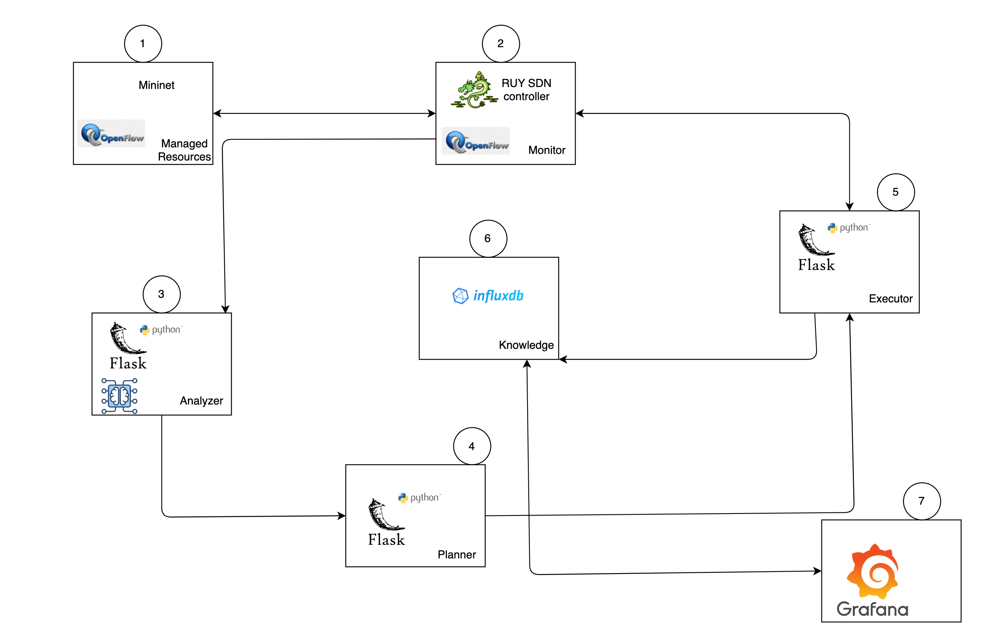
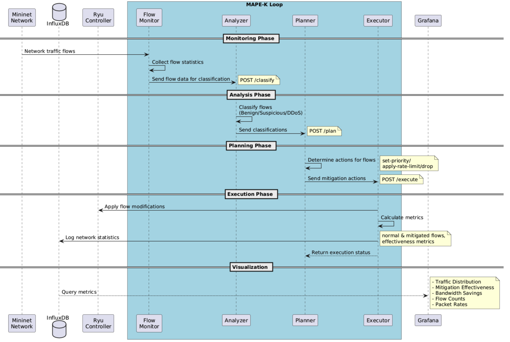
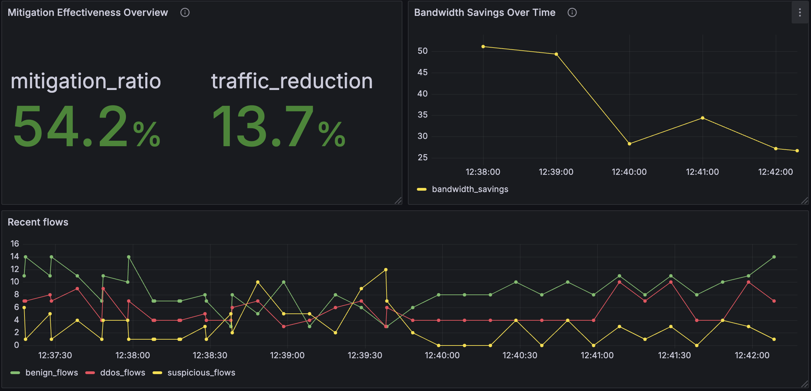
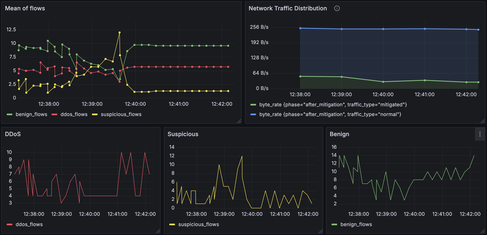
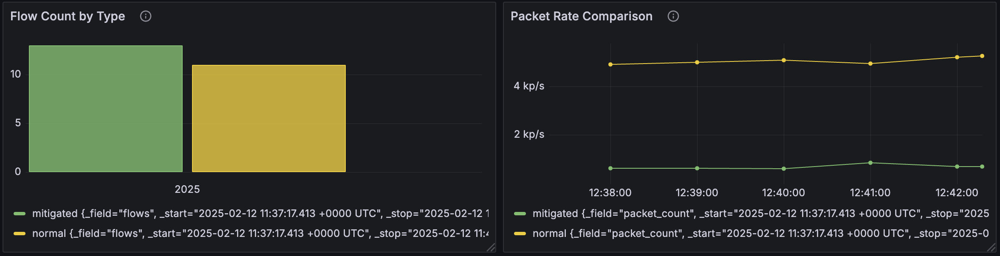

# SE4AS SDN Project - DDoS Mitigation System

This project implements a Self-Adaptive Software-Defined Network (SDN) controller using the MAPE-K (Monitor, Analyze, Plan, Execute) feedback loop architecture. The system provides automated DDoS attack detection and mitigation through real-time network monitoring and adaptive control.

## System Overview

### System Architecture



The system implements a complete MAPE-K feedback loop for network management with the following components:

1. **Mininet with OpenFlow**
    * Network emulation environment
    * Managed resources using OpenFlow protocol
    * Simulates network topology and traffic

2. **RYU SDN Controller with Monitor**
    * OpenFlow controller for network management
    * Collects real-time flow statistics
    * Interfaces between network and analysis components

3. **Analyzer with ML Model**
    * Flow classification using machine learning
    * Adaptive threshold calculation
    * Three-tier classification:
        - Benign: Normal traffic
        - Suspicious: Potentially harmful
        - DDoS: Confirmed attack traffic
    * Real-time flow categorization logging

4. **Planner**
    * Determines mitigation strategies based on flow categories:
        - set-priority for benign flows
        - apply-rate-limit for suspicious flows
        - drop for DDoS flows
    * Coordinates with executor for action implementation

5. **Executor**
    * Implements network changes through Ryu
    * Calculates effectiveness metrics
    * Logs mitigation statistics

6. **InfluxDB (Knowledge Base)**
    * Time-series database for metrics storage
    * Stores:
        - Flow categories and distributions
        - Network traffic statistics
        - Mitigation effectiveness metrics
        - Bandwidth utilization data

7. **Grafana (Visualization)**
    * Three specialized dashboards:
        - Flow Analysis: counts and packet rates
        - Mitigation Metrics: effectiveness and savings
        - Traffic Analysis: detailed flow breakdown
    * Real-time monitoring and historical analysis

### System Workflow



The sequence diagram shows the detailed workflow of the system:

1. **Monitoring Phase**
   - Network traffic flows are collected
   - Flow Monitor sends data for classification

2. **Analysis Phase**
   - Analyzer classifies flows (Benign/Suspicious/DDoS)
   - Classifications are sent to Planner

3. **Planning Phase**
   - Planner determines appropriate actions
   - Actions are sent to Executor

4. **Execution Phase**
   - Flow modifications are applied
   - Metrics are calculated and logged
   - Execution status is returned

5. **Visualization**
   - Metrics are queried and displayed in Grafana
   - Shows traffic distribution and effectiveness

### Dashboard Visualization





The Grafana dashboard is organized into three main views for comprehensive monitoring:

### Dashboard 1: Flow Analysis
1. **Flow Count by Type**:
   - Bar chart comparing normal vs mitigated flows
   - Real-time view of flow distribution

2. **Packet Rate Comparison**:
   - Line graph showing packet rates over time
   - Separate lines for normal and mitigated traffic
   - Measured in kp/s (kilopackets per second)

### Dashboard 2: Mitigation Metrics
1. **Mitigation Effectiveness Overview**:
   - Mitigation Ratio: Percentage of flows being mitigated (54.2%)
   - Traffic Reduction: Percentage of reduced malicious traffic (13.7%)

2. **Bandwidth Savings Over Time**:
   - Line graph showing bandwidth saved through mitigation
   - Measured in bytes per second

3. **Recent Flows**:
   - Real-time flow tracking
   - Color-coded lines for benign, suspicious, and DDoS flows

### Dashboard 3: Detailed Traffic Analysis
1. **Mean of Flows**:
   - Average flow rates for each traffic type
   - Separate tracking for benign, suspicious, and DDoS flows

2. **Network Traffic Distribution**:
   - Byte rate comparison between normal and mitigated traffic
   - Measured in B/s (Bytes per second)

3. **Flow Type Breakdown**:
   - Individual graphs for DDoS, Suspicious, and Benign flows
   - Historical view of each flow type's behavior
   - Helps identify patterns and trends

### Key Features

- Real-time network flow monitoring
- Automatic DDoS attack detection
- Adaptive traffic classification (Benign/Suspicious/DDoS)
- Automated mitigation strategies
- Comprehensive metrics and visualization
- Docker-based microservices architecture

## Prerequisites

- Docker Engine (20.10.0 or higher)
- Docker Compose (2.0.0 or higher)
- 4GB RAM minimum
- 10GB free disk space

## Quick Start

1. **Clone the Repository**
   ```bash
   git clone https://github.com/ManassehV2/SE4AS_SDN.git
   cd SE4AS_SDN
   ```

2. **Start the System**
   ```bash
   # Build and start all services
   docker-compose up -d

   # Verify all services are running
   docker-compose ps
   ```

3. **Access System Interfaces**

   a. **Grafana Dashboard**
   - URL: http://localhost:3000
   - Default credentials:
     - Username: admin
     - Password: admin
   - Features:
     - Real-time traffic monitoring
     - Mitigation effectiveness metrics
     - Network flow analysis

   b. **Network Topology**
   - URL: http://localhost:8080
   - Visualize the complete SDN network topology
   - Monitor real-time network connections

## Component Details

### 1. Monitor (Ports: 6653, 8080)
- Collects network flow statistics
- Interfaces with SDN switches via OpenFlow
- Exposes REST API for flow data

### 2. Analyzer (Port: 5004)
- Classifies network flows
- Detection criteria:
  - Flow rate analysis
  - Packet pattern matching
  - Traffic distribution analysis

### 3. Planner (Port: 5001)
- Determines mitigation actions
- Action types:
  - set-priority: Normal traffic
  - apply-rate-limit: Suspicious flows
  - drop: Confirmed DDoS flows

### 4. Executor (Port: 5002)
- Implements mitigation actions
- Logs effectiveness metrics
- Provides feedback for adaptation

### 5. InfluxDB (Port: 8086)
- Stores network metrics
- Configuration:
  - Organization: my-org
  - Bucket: network_stats
  - Retention: 7 days

## Monitoring and Visualization

### Grafana Dashboards

1. **Traffic Overview Panel**
   - Real-time traffic distribution
   - Normal vs. Mitigated flows
   

2. **Mitigation Effectiveness**
   - Traffic reduction ratio
   - Bandwidth savings
   - Mitigation success rate

3. **Flow Analysis**
   - Packet rate comparison
   - Flow count by type
   - Bandwidth utilization

### Key Metrics

- **Traffic Reduction**: Percentage of mitigated traffic
- **Mitigation Ratio**: Proportion of flows requiring mitigation
- **Bandwidth Savings**: Network resources preserved

## Troubleshooting

1. **Service Health Check**
   ```bash
   docker-compose ps
   docker logs se4as_monitor
   ```

2. **Common Issues**
   - InfluxDB connection: Check credentials and ports
   - Monitor not receiving flows: Verify SDN switch connectivity
   - High CPU usage: Check resource allocation in docker-compose.yml

3. **Metric Collection Issues**
   ```bash
   # Check InfluxDB status
   curl -I http://localhost:8086
   
   # Verify metrics writing
   docker logs se4as_execute | grep "Logged network stats"
   ```

## Configuration

### Environment Variables
```env
INFLUXDB_HOST=influxdb
INFLUXDB_PORT=8086
INFLUXDB_BUCKET=network_stats
DOCKER_INFLUXDB_INIT_ORG=my-org
DOCKER_INFLUXDB_INIT_USERNAME=admin
DOCKER_INFLUXDB_INIT_PASSWORD=admin123
```

### Resource Limits
```yaml
services:
  monitor:
    mem_limit: 512M
  analyze:
    mem_limit: 256M
  plan:
    mem_limit: 256M
  execute:
    mem_limit: 256M
```

## Project Structure
```
SE4AS_SDN/
├── monitor/
│   ├── app/
│   │   ├── flow_monitor.py    # Flow statistics collection
│   │   └── simple_controller.py
│   └── Dockerfile
├── analyze/
│   ├── app/
│   │   └── analyze.py         # Traffic classification
│   └── Dockerfile
├── plan/
│   ├── app/
│   │   └── plan.py           # Mitigation planning
│   └── Dockerfile
├── execute/
│   ├── app/
│   │   └── execute.py        # Action implementation
│   └── Dockerfile
├── influxdb-config/          # InfluxDB configuration
├── docker-compose.yml        # Service orchestration
└── README.md
```

## Networks
All services communicate through the `se4as_network` Docker network:
```yaml
networks:
  se4as_network:
    driver: bridge
```

## Contributing
1. Fork the repository
2. Create a feature branch
3. Commit changes
4. Submit pull request

## License
This project is licensed under the MIT License - see the LICENSE file for details.

## Support
For issues and feature requests, please use the GitHub issue tracker.